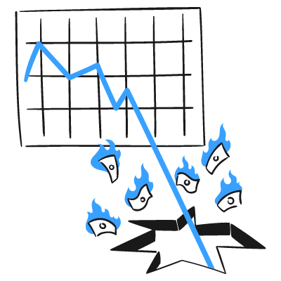
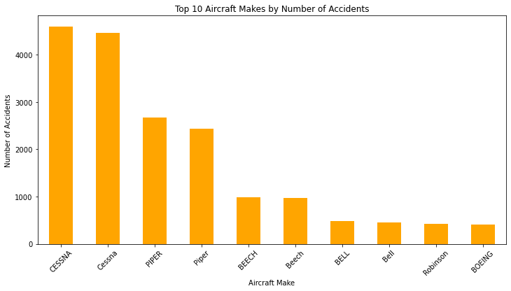

#
#
This project explores and analyzes aviation accident data to uncover key trends and patterns. The goal is to provide insights that can support business decisions, such as acquiring a new fleet, improving safety measures, and understanding accident dynamics.

Using Python (Pandas, Matplotlib, Seaborn) for initial data analysis, and Tableau for dashboard creation, we highlight the critical factors influencing aviation accidents over time.

#
#: Visualized trends in the number of aviation accidents over the years.

Fatal Injuries: Identified the year with the most and least fatal injuries.

#: Highlighted the most common aircraft makes and models involved in accidents.

Weather Conditions: Determined the most prevalent weather conditions during accidents.

Broad Phase of Flight: Analyzed at what phase (e.g., landing, takeoff) most accidents occurred.

Top KPIs: Extracted high-level KPIs like total accidents, total fatal injuries, and most common flight/weather conditions.

Technologies Used
Python: Data cleaning and preliminary analysis (Pandas, Seaborn, Matplotlib)

Jupyter Notebook: Interactive coding environment

Git & GitHub: Version control and project management

Tableau: Interactive dashboards and data visualization

 Tableau Dashboard Features
Total Accidents KPI

Total Fatal Injuries KPI

Top Weather Condition KPI

Most Common Broad Phase of Flight KPI

Accidents by Year (Bar Chart)

Accidents by Make (Bar Chart)

Broad Phase of Flight vs Year (Heatmap)

 How to View This Project
Clone the repository:

bash
Copy
Edit
git clone https://github.com/MercyBarminga/DSPT11-Phase1-Project.git
Open the Jupyter Notebook to explore the Python code.

Open the Tableau .twbx file to view the full interactive dashboard.

Note: You need to have Tableau Desktop (or Tableau Public) installed to open Tableau files.

 Recommendations
Prioritize aircraft models with fewer historical accident records when acquiring new fleets.

Pay special attention to weather patterns; VMC (Visual Meteorological Conditions) dominated accident weather conditions.

Focus on pilot training during the landing phase, which had high accident counts.

Invest in preventive maintenance and operational safety for the most common makes/models identified.

Historical accident patterns suggest consistent monitoring and updating of aviation safety protocols.

#
Mercy Jebii Barminga
Data Scientist

